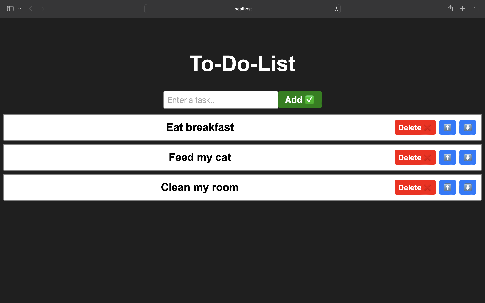

# ToDoList
A simple, interactive to-do list app built with React. Add tasks, reorder them, and remove them as you complete them — all with a clean, minimal interface.

## Features

- ✅ Add new tasks
- ❌ Delete tasks
- ⬆️⬇️ Reorder tasks up or down in the list
- Built with React hooks (`useState`) for state management

## Tech Stack

- React
- Vite
- CSS



## Getting Started

Follow these steps to run the project locally.

### Prerequisites

Make sure you have [Node.js](https://nodejs.org/) installed on your machine.

### Installation

1. Clone the repository
```bash
   git clone https://github.com/arwashah/ToDoList.git
```

2. Navigate into the project folder
```bash
   cd ToDoList
```

3. Install dependencies
```bash
   npm install
```

4. Start the development server
```bash
   npm run dev
```

5. Open your browser and go to the URL shown in the terminal (usually `http://localhost:5173`)

## Future Improvements

- Mark tasks as complete/incomplete
- Persist tasks with local storage
- Edit existing tasks
